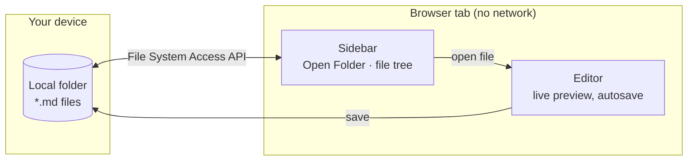

  

# HAMDE

*Here's Another Markdown Editor.*

**[Try it live → hamde.mau628.com](https://hamde.mau628.com)**

A free, open-source, local-first Markdown editor with an Obsidian-style live preview.
It runs entirely in your browser and edits the files in a folder on your own disk.
No backend, no account, no upload — the app makes no network request at all once the
page has loaded.

Markdown renders as you write it, in place. The line your cursor is on shows its
syntax; everything else reads as the finished document.

## Requirements

A Chromium-based browser. The editor is built on the
[File System Access API](https://developer.mozilla.org/en-US/docs/Web/API/Window/showDirectoryPicker),
which Firefox and Safari do not implement. This is a deliberate scope decision, not
an oversight: that API is what makes editing your own files possible without a
server in the middle.

Node.js 24.11 or newer for development.

## What it does

- **Open a folder** and browse it. Directories are read one level at a time, so a
  folder with thousands of notes opens immediately.
- **Edit Markdown with live preview.** Headings, bold, italic, strikethrough, inline
  code, blockquotes, lists, links and images render in place. The document on disk is
  never transformed: it stays exactly the Markdown you wrote.
- **Task lists you can click.** A checkbox changes one character of the file.
- **GitHub Flavored Markdown**: tables, task lists, strikethrough and autolinks.
- **Tables rendered as tables**, with column alignment and the inline Markdown
  inside each cell. Click a cell, or arrow into the table, to edit its source.
- **Fenced code, highlighted** in JavaScript, TypeScript, JSON, HTML, CSS, SQL, XML,
  YAML, bash, PowerShell and C#. Each grammar is downloaded only if a document uses
  it.
- **Mermaid diagrams**, rendered in place. Click one, or arrow into it, to edit its
  source. Mermaid itself is only downloaded when a diagram is actually drawn.
- **Fences close themselves.** Typing the third backtick of a fence adds the closing one.
- **Autosave**, 500 ms after you stop typing, and immediately on Ctrl+S, when the
  window loses focus, when the tab is hidden, and before switching documents.
- **External changes are never overwritten.** If another program writes the file
  while you have it open, the app stops and asks whether to reload it or keep your
  version.
- **Picks up where you left off.** The last folder and its first file reopen on the
  next visit. Chrome usually drops folder permission on reload, so the first click or
  key press in the page asks for it back, once. "Close folder" (the × next to Open
  Folder) forgets it.
- **Light and dark themes**, following the system until you choose one.
- **Narrow or wide editor**, toggled with the button in the editor or Ctrl/Cmd+,.

Only three small preferences stay in the browser, and none of them is note content:
the last folder's handle (IndexedDB), the theme and editor width, and whether the
welcome dialog is hidden (localStorage). See [docs/security.md](docs/security.md).

## What it deliberately does not do

- Load anything over the network, including remote images. A remote image is shown
  as Markdown source; fetching it would tell that server which note you are reading.
- Render HTML embedded in a document. It is displayed as text.
- Follow a link whose protocol is not http, https or mailto.
- Rewrite parts of a file you did not edit — including its line endings.

## Commands

| Command                 | What it does                                                       |
| ----------------------- | ------------------------------------------------------------------ |
| `npm run dev`           | Development server                                                 |
| `npm run generate`      | Static build into `.output/public`, then applies CSP script hashes |
| `npm run serve:static`  | Serves `.output/public` exactly as a static host would             |
| `npm run typecheck`     | `vue-tsc --noEmit`                                                 |
| `npm run test`          | Unit tests (Vitest)                                                |
| `npm run test:e2e`      | Builds, then runs browser tests (Playwright/Chromium)              |
| `npm run check:offline` | Fails if the build references any remote origin                    |
| `npm run verify`        | typecheck + unit tests + build + offline check                     |

## Documentation

- [docs/live-preview.md](docs/live-preview.md) — how the rendering works, and what it
  deliberately does not render
- [docs/security.md](docs/security.md) — the threat model and every security decision,
  including the ones that are compromises
- [docs/dependencies.md](docs/dependencies.md) — why each dependency exists, what was
  rejected, and what the build actually weighs

## Status

The MVP is complete and deployed at [hamde.mau628.com](https://hamde.mau628.com):
open a folder, edit Markdown with live preview, save automatically, resolve external
changes, and render code and diagrams — all of it without a byte leaving the machine.

Possible next steps, none of which the editor needs rewriting for: wikilinks and
search.

## Deployment and SEO

`npm run generate` produces a static site, and the GitHub Actions workflow publishes
it to GitHub Pages on every push to `main`. It is served from the root of its own
domain, so no base path is needed. The canonical URL used in the page metadata
defaults to `https://hamde.mau628.com`; override it with `NUXT_PUBLIC_SITE_URL`.

For search engines and AI crawlers the page carries a description, Open Graph tags,
JSON-LD (`WebApplication`) and `<noscript>` text, and `public/` ships `robots.txt`,
`sitemap.xml` and `llms.txt`. The sitemap, robots and llms.txt files hard-code the
domain, so update them if it changes.
